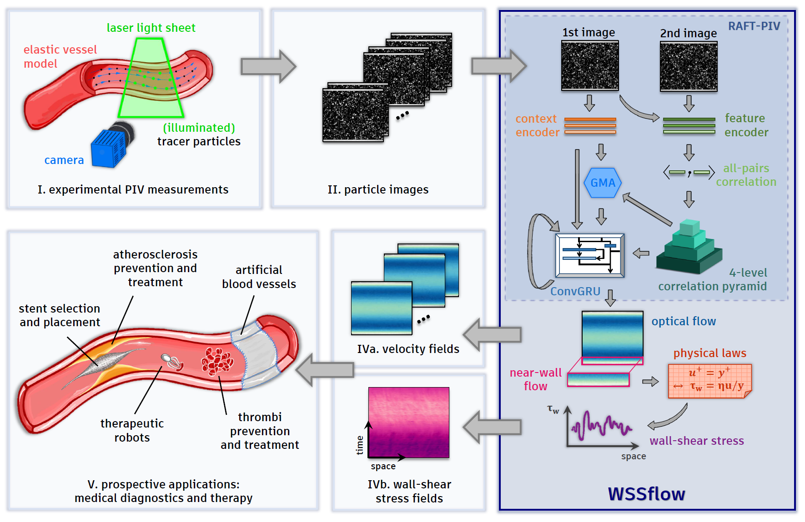

[](https://zenodo.org/doi/10.5281/zenodo.10981067)
## WSSflow - Uncovering wall-shear stress dynamics from neural-network enhanced fluid flow measurements



### Overview
This is the official PyTorch implementation of our paper [Uncovering wall-shear stress dynamics from neural-network enhanced fluid flow measurements](https://arxiv.org/abs/2310.11147).

## Requirements
The code has been tested with PyTorch 2.0 and Cuda 11.7 on a NVIDIA A100 40Gb.
```Shell
conda create --name WSSflow
conda activate WSSflow
conda install pytorch=2.0.0 torchvision=0.15.0 torchaudio=2.0.0 pytorch-cuda=11.7 -c pytorch -c nvidia
pip install einops==0.6.0 matplotlib==3.6.0 argcomplete==2.0.0 h5py==3.8.0 tqdm==4.65.0
```

## Pretrained models
Pretrained models can be found in `./pretrained_ckpts`. 

## Required Data
To train WSSflow, you will need to download the required [datasets](https://doi.org/10.5281/zenodo.10047202)

## Evaluation
You can evaluate a pretrained WSSflow model using `testing.py`. The following command is an example for inference on a minimal test dataset:
 ```Shell
CUDA_VISIBLE_DEVICES=0 LOCAL_RANK=0 WORLD_SIZE=1 RANK=0 MASTER_ADDR=127.0.0.1 MASTER_PORT=44444 python testing.py --nodes 1 --gpus 1 --name example_testing  --arch RAFT_GMA --input_path_ckpt ./pretrained_ckpts/pretrained_RAFT-PIV_GMA_model.ckpt --validation_file ./data/TCF_minimal_dataset.hdf5 --offset 128 --shift 64 --cropSize 16 --return_values True
```


